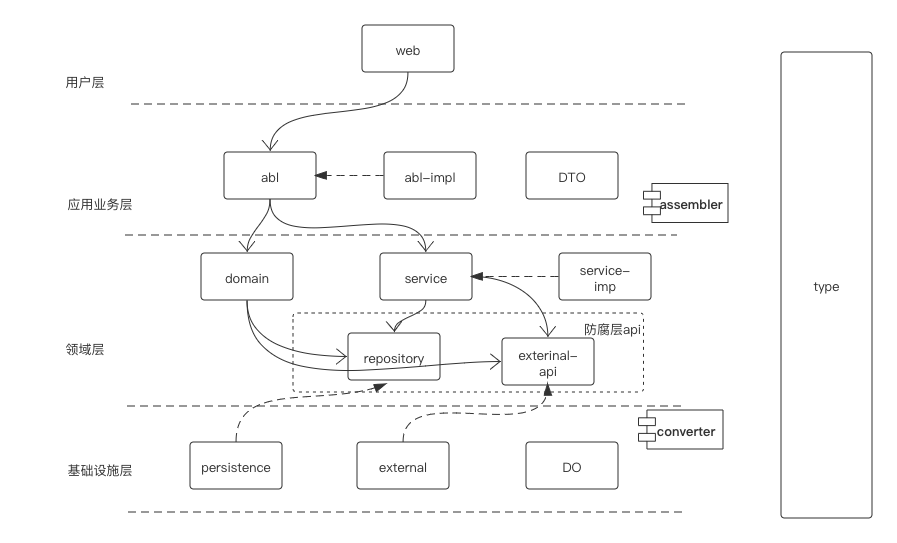

## 代码生成工具 
基于DDD微服务多模块项目
## 包结构介绍

    
## 技术框架
  + `sring-cloud`
  + `spring-boot`
  + `mybatis-plus`
  + `nacos`
  + `postrgesql`
  +  `sentinel`
  +  `open-feign`
  + `seata`
  + `spring-doc(swagger3)`
  + `mapstruct`
  + `flyway`
  + `redis-cluster`
    
## 启动默认端口 
    8080 

## 启动方式  
```shell script
java -jar miis-web-portal.jar --spring.cloud.nacos.config.server-addr=127.0.0.1:8848 \
                 --spring.cloud.nacos.config.file-extension=yaml \
                 --spring.cloud.nacos.config.namespace=ns-miis \
                 --spring.application.name=miis \
                 --server.port=8080
```
